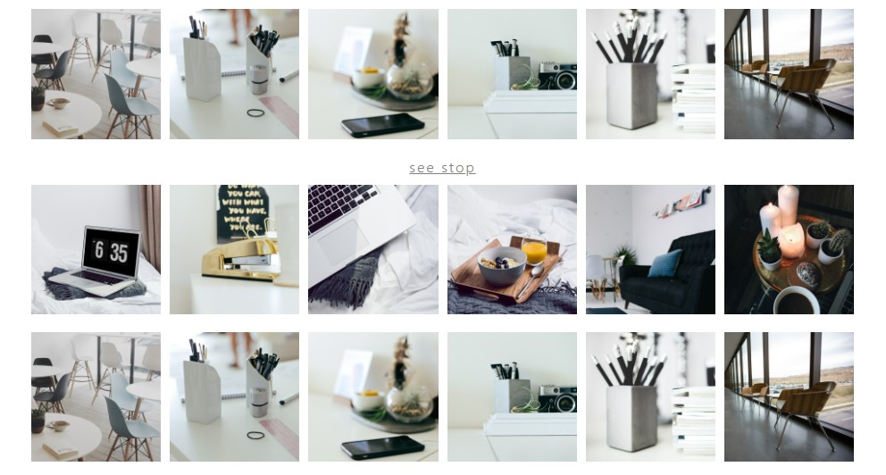
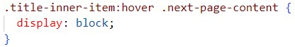

# SideProject

## 1. 목표 사이트

- [MondayKiz](https://mondaykizcompany.com/)


<br>

## 2. 진행 계획

> - 22-10-06 ~ 22-10-07 : 메인 페이지와 그 외 페이지들을 구상 및 구현
>
>   - PC 브라우저 전체 화면 기준
>
>     <br>
>
> - 22-10-07 ~ 22-10-08 : 페이지 HTML&CSS 수정 및 보완 / Javascript 동적 기능 추가
>
> - 22-10-08 ~ 22-10-09 : 추가적으로 필요한 페이지들 구상 및 구현
>
>   - PC 브라우저 전체 화면 기준
>
>     <br>
>
> - 22-10-09 ~ 22-10-10 : 페이지 HTML&CSS 수정 및 보완 / Javascript 동적 기능 추가
>
> - 22-10-10 ~ 22-10-11 : 전체 페이지 media query를 통한 반응형 웹페이지 구현
>
> - 22-10-11 ~ 22-10-12 : 반응형 웹 페이지 마무리 작업 및 버그 수정 & 미비한 작업 추가
>
> - 22-10-12 : SideProject 발표

<br>

## 3. 차이점

- 원본 페이지에서는 마우스를 hover하지 않아도 hover한 영역이 보여진다.

  

- 원본 페이지와는 다르게 모든 그림에 hover를 했을 때 나오게 CSS 효과 재설정


<hr>

- 원본 페이지에서는 see more 버튼을 클릭을 해도 아무 반응이 없다

  

- 원본 페이지와는 다르게 see more 버튼을 클릭 시 숨겨놨던 영역이 등장 하거나 다시 누르면 사라진다



<hr>

- 원본 페이지에서는 일정 너비가 되면 헤더의 높이가 달라지면서 배너가 다른 배너를 가리는 상황이 나타난다

  

- 높이에 대한 헤더의 효과를 제거 하고 모든 배너가 계속 같은 선상에 있도록 설정


<hr>

<br>

## 4. 이슈사항

1. 메인 헤더의 배너 hover 시 생기는 dropdown 효과

   - 숨겨둔 content의 부모 엘리먼트에게 position:relative 속성을 설정
   - content에게는 position:absolute 속성을 부여하고 원하는 위치 조절
   - 설정 후 content의 부모 엘리먼트에 hover시 content의 display 설정 block

   ```css
   .title-inner-item {
     font-size: 1.2rem;
     color: gray;
     display: inline-block;
     padding: 5px;
     position: relative;
   }
   ```

   ```css
   .next-page-content {
     display: none;
     position: absolute;
     top: 40px;
     left: -10px;
     background-color: white;
     width: max-content;
     padding: 10px 5px;
   }
   ```

    

<hr>

2. 일정 영역을 마우스 hover 시 버튼의 색상을 서서히 채우는 효과

   - 가수 이미지와 버튼이 있는데, 만일 이미지에 hover하면 이미지의 scale이 커지면서 버튼의 색상이 서서히 채워진다
   - 버튼에만 마우스 hover시 이미지는 커지지않고 색상만 서서히 채워진다

   ```css
   #see-details {
     text-decoration: none;
     color: gray;
     border: 1px solid gray;
     padding: 10px 50px;
     font-size: 0.7rem;
     position: relative;
     display: inline-block;
     overflow: hidden;
     z-index: 3;
   }
   #see-details::after {
     content: "";
     position: absolute;
     top: 0;
     left: 0;
     width: 0;
     height: 100%;
     background-color: lightgray;
     transition: none;
   }
   ```

   ```css
   .singer-flex-item img:hover {
     transform: scale(1.15);
   }
   .signer-flex-item:hover #see-details::after {
     width: 120%;
     background-color: blue;
     z-index: -1;
     transition: all 0.5s linear;
   }
   ```

<hr>

3. 모바일 기준 메뉴 dropdown


